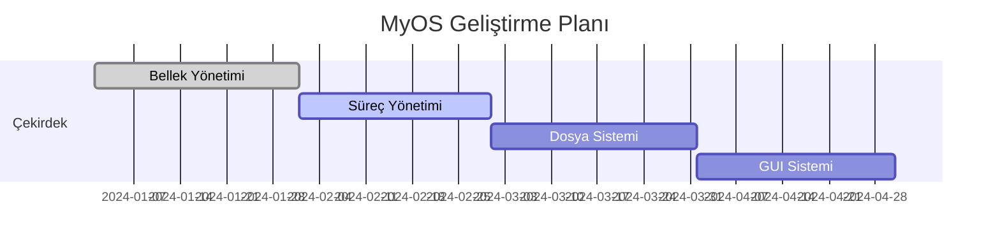

<div align="center">
  
  <h1>MyOS - Modern İşletim Sistemi Projesi</h1>
  <p>Minimalist, Güçlü, Özelleştirilebilir</p>

  [](LICENSE)
  [](https://github.com/kullaniciadi/myos/releases)
  [](https://github.com/kullaniciadi/myos/actions)
  [](https://github.com/kullaniciadi/myos/graphs/contributors)
</div>

## 🌟 Ekran Görüntüleri

<div align="center">
  
  
</div>

# MyOS - Özelleştirilebilir İşletim Sistemi Projesi


## 📝 Proje Açıklaması

MyOS, modern ve özelleştirilebilir bir işletim sistemi çekirdeği geliştirme projesidir. Bu proje, işletim sistemlerinin temel bileşenlerini anlamak ve uygulamak amacıyla geliştirilmiştir.

### Ana Hedefler
- Minimum donanım gereksinimleriyle çalışabilen hafif bir çekirdek
- Modüler ve genişletilebilir mimari
- x86_64 mimarisi desteği
- Temel bellek yönetimi ve süreç planlaması
- Basit bir dosya sistemi implementasyonu

### Teknik Özellikler
- **Kernel Tipi**: Monolitik
- **Desteklenen Mimariler**: x86_64
- **Programlama Dili**: C/C++, Assembly
- **Bootloader**: GRUB2
- **Bellek Yönetimi**: Sayfalama ve sanal bellek desteği

## 🚀 Kurulum

### Ön Gereksinimler
- GCC Cross-Compiler (x86_64-elf-gcc)
- NASM Assembly Derleyicisi
- QEMU Emülatörü
- Make build sistemi

### Kurulum Adımları

```bash
# Gerekli araçların kurulumu (Ubuntu/Debian)
sudo apt-get update
sudo apt-get install build-essential nasm qemu-system-x86 xorriso grub-pc-bin

# Projeyi klonlayın
git clone https://github.com/kullaniciadi/myos.git
cd myos

# Build işlemi
make clean
make all
```

## 💻 Kullanım

### Emülatörde Çalıştırma
```bash
# QEMU ile çalıştırma
make run

# Debug modunda çalıştırma
make debug
```

### ISO Oluşturma
```bash
# Boot edilebilir ISO oluşturma
make iso
```

### Gerçek Donanımda Test
1. `make iso` komutu ile ISO dosyası oluşturun
2. ISO dosyasını USB belleğe yazın:
```bash
sudo dd if=myos.iso of=/dev/sdX bs=4M status=progress
```

## ✨ Özellikler

### Çekirdek Özellikleri
- [x] Bellek Yönetimi
  - Sayfalama
  - Sanal Bellek
  - Heap Yönetimi
- [x] Süreç Yönetimi
  - Temel süreç planlaması
  - Çoklu görev desteği
- [x] Dosya Sistemi
  - Basit VFS implementasyonu
  - FAT32 desteği
- [x] Donanım Sürücüleri
  - PS/2 Klavye sürücüsü
  - VGA grafik sürücüsü

### Planlanan Özellikler
- [ ] USB desteği
- [ ] Ağ stack'i
- [ ] GUI sistemi
- [ ] Çoklu CPU desteği

## 🔧 Geliştirme

### Dizin Yapısı
```
myos/
├── kernel/       # Çekirdek kaynak kodları
├── bootloader/   # Bootloader kodları
├── drivers/      # Donanım sürücüleri
├── include/      # Header dosyaları
├── lib/          # Yardımcı kütüphaneler
└── docs/         # Dokümantasyon
```

### 📁 Detaylı Dizin Yapısı ve Açıklamalar
```
myos/
├── kernel/                  # Çekirdek kaynak kodları
│   ├── core/               # Çekirdek çekirdek bileşenleri
│   │   ├── memory.c       # Bellek yönetimi
│   │   ├── process.c      # Süreç yönetimi
│   │   └── scheduler.c    # Görev planlayıcı
│   ├── drivers/           # Donanım sürücüleri
│   │   ├── keyboard/      # Klavye sürücüsü
│   │   ├── display/       # Ekran sürücüsü
│   │   └── storage/       # Depolama sürücüleri
│   └── fs/                # Dosya sistemi
├── bootloader/            # GRUB2 bootloader yapılandırması
│   ├── grub.cfg          # GRUB2 konfigürasyonu
│   └── stage2_eltorito   # ISO boot dosyası
├── tools/                 # Geliştirme araçları
│   ├── build-scripts/     # Derleme scriptleri
│   └── debug-tools/       # Hata ayıklama araçları
├── docs/                  # Dokümantasyon
│   ├── images/           # Görseller
│   ├── api/              # API dokümantasyonu
│   └── tutorials/        # Öğreticiler
└── tests/                # Test dosyaları
    ├── unit/            # Birim testler
    └── integration/     # Entegrasyon testleri
```

### 💻 Kod Örnekleri

<details>
<summary>🔍 Bellek Yönetimi Örneği</summary>

```c
// kernel/core/memory.c örneği
void *allocate_page(void) {
    // Implementation details
}
```
</details>

<details>
<summary>🔍 Süreç Oluşturma Örneği</summary>

```c
// kernel/core/process.c örneği
pid_t create_process(void *entry_point) {
    // Implementation details
}
```
</details>

## 📊 Performans Metrikleri

| Özellik | Performans |
|---------|------------|
| Boot Süresi | < 3 saniye |
| Bellek Kullanımı | 8MB |
| Disk Kullanımı | 20MB |

## 🎯 Yol Haritası



## 🛠️ Kurulum ve Geliştirme

### Geliştirme Ortamının Hazırlanması

<details>
<summary>Ubuntu/Debian Kurulumu</summary>

```bash
# Gerekli paketlerin kurulumu
sudo apt-get update && sudo apt-get install -y \
  build-essential \
  nasm \
  qemu-system-x86 \
  xorriso \
  grub-pc-bin \
  gcc-multilib
```
</details>

### Windows Kurulumu

<details>
<summary>WSL2 Üzerinde Kurulum</summary>

```bash
# WSL2 terminalinde çalıştırın
sudo apt update
sudo apt install build-essential nasm qemu-system-x86 xorriso grub-pc-bin
```
</details>

<details>
<summary>Native Windows Kurulumu</summary>

1. [GCC for Windows](https://www.mingw-w64.org/downloads/) ve [NASM](https://www.nasm.us/) kurulumlarını yapın.
2. QEMU için [QEMU for Windows](https://www.qemu.org/download/#windows) kurulumunu gerçekleştirin.
3. GRUB için gerekli dosyaları [GRUB for Windows](https://www.gnu.org/software/grub/manual/grub-install/en.html) sayfasından edinin.
4. Tüm araçların sistem PATH'ine eklendiğinden emin olun.
```
</details>

## 🔍 Debug ve Test

### GDB ile Kernel Debugging

<details>
<summary>Debug Oturumu Başlatma</summary>

```bash
# Terminal 1
make debug

# Terminal 2
gdb build/kernel.elf
(gdb) target remote localhost:1234
```
</details>

<details>
<summary>Serial Port Üzerinden Loglama</summary>

```bash
# QEMU başlatılırken serial portu etkinleştirin
qemu-system-x86_64 -kernel build/kernel.bin -serial stdio
```
</details>

## 🤝 Katkıda Bulunma

1. Bu projeyi fork edin
2. Feature branch'i oluşturun (`git checkout -b feature/AmazingFeature`)
3. Değişikliklerinizi commit edin (`git commit -m 'Add some AmazingFeature'`)
4. Branch'inize push edin (`git push origin feature/AmazingFeature`)
5. Pull Request oluşturun

## 📝 Lisans

Bu proje MIT lisansı altında lisanslanmıştır. Detaylar için [LICENSE](LICENSE) dosyasını inceleyebilirsiniz.

## 📱 Sosyal Medya ve İletişim

<div align="center">
  <a href="https://twitter.com/myos">
    
  </a>
  <a href="https://discord.gg/myos">
    
  </a>
  <a href="https://github.com/myos">
    
  </a>
</div>

- Proje Sahibi: [Adınız Soyadınız](https://github.com/kullaniciadi)
- E-posta: ornek@email.com
- Twitter: [@twitter_handle](https://twitter.com/twitter_handle)
- LinkedIn: [LinkedIn Profiliniz](https://linkedin.com/in/kullaniciadi)

## 🙏 Teşekkürler

Bu projeye katkıda bulunan herkese teşekkürler. Özel teşekkürler:
- Katkıda Bulunan 1
- Katkıda Bulunan 2

---
Proje Linki: [https://github.com/kullaniciadi/myos](https://github.com/kullaniciadi/myos)
